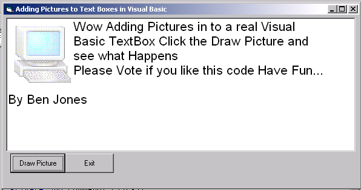



## Add Pictures to Text Boxes in VB

### Description

I was Working with the WIN32 API Functions and came up with this cool little code that will let you add a Picture to a text Box Have a look at the screen shot to see wat I mean Please Vote...
 
### More Info
 

             |
---                |---
**Submitted On**   |2001-01-29 02:22:26
**By**             |[dreamvb](https://github.com/Planet-Source-Code/PSCIndex/blob/master/ByAuthor/dreamvb.md)
**Level**          |Intermediate
**User Rating**    |4.5 (126 globes from 28 users)
**Compatibility**  |VB 6\.0
**Category**       |[Graphics](https://github.com/Planet-Source-Code/PSCIndex/blob/master/ByCategory/graphics__1-46.md)
**World**          |[Visual Basic](https://github.com/Planet-Source-Code/PSCIndex/blob/master/ByWorld/visual-basic.md)
**Archive File**   |[CODE\_UPLOAD142291272001\.zip](https://github.com/Planet-Source-Code/dreamvb-add-pictures-to-text-boxes-in-vb__1-14770/archive/master.zip)

